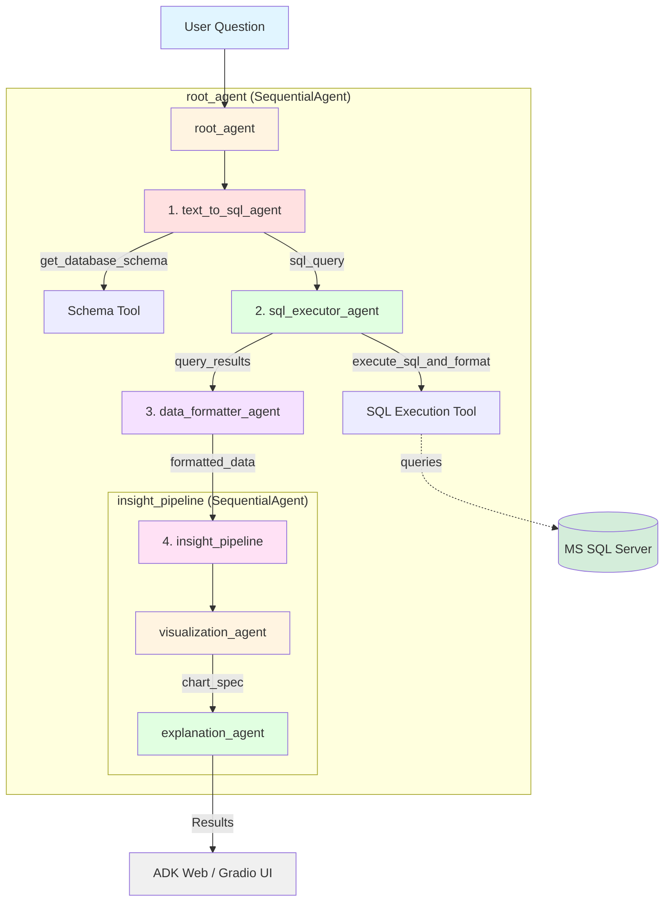

# Business Intelligence Agent with Google ADK


A production-ready **Business Intelligence agent system** built with [Google's Agent Development Kit (ADK)](https://google.github.io/adk-docs/) featuring dual interfaces: ADK web and [Gradio](https://gradio.app/).

The system converts natural language questions into SQL queries, executes them against Microsoft SQL Server, and automatically generates visualizations and explanations using Google's Gemini AI.

## ✨ Key Features

- 🤖 **Multi-Agent Pipeline**: Sequential agent workflow using ADK's SequentialAgent pattern
- 🌐 **Dual Interfaces**: ADK web UI + Gradio web interface (same agent logic)
- 🔐 **Production-Ready**: COMPASS framework prompts, SQL validation, error handling
- 📊 **Auto-Visualization**: Intelligent chart generation with Altair
- 💬 **Business Insights**: AI-powered plain-language explanations
- 🛠️ **Tool-Based Architecture**: Agents use tools for database operations

## Architecture Overview



### How It Works

1. **User Question** enters the `root_agent` (SequentialAgent)
2. **text_to_sql_agent** retrieves schema and generates SQL query
3. **sql_executor_agent** executes SQL against database via tool
4. **data_formatter_agent** prepares results for visualization
5. **insight_pipeline** (SequentialAgent) creates:
   - **visualization_agent**: Altair chart code
   - **explanation_agent**: Business insights
6. All outputs displayed in **ADK web** or **Gradio UI**

## What You'll Learn

- Build production-ready multi-agent systems with Google ADK
- Implement the **COMPASS framework** for reliable prompts
- Use **Chain of Thought** reasoning to reduce AI hallucinations
- Create **tool-based agents** for database operations
- Structure projects for both ADK web and custom UIs
- Handle SQL safely with validation and error handling
- Generate automatic visualizations with AI
- Deploy dual interfaces with shared agent logic

## The Agent Architecture

### Root Agent (Entry Point)

```python
root_agent = SequentialAgent(
    name='root_agent',
    sub_agents=[
        text_to_sql_agent,      # SQL generation
        sql_executor_agent,      # Query execution
        data_formatter_agent,    # Data formatting
        insight_pipeline         # Viz + Explanation
    ]
)
```

The **root_agent** orchestrates the complete BI pipeline as a single SequentialAgent.

### Sub-Agents

#### 1. Text-to-SQL Agent
Converts natural language to SQL using database schema context.

**Tool**: `get_database_schema()` - Retrieves available tables and columns

#### 2. SQL Executor Agent
Executes SQL queries safely against the database.

**Tool**: `execute_sql_and_format()` - Validates and runs SELECT queries

#### 3. Data Formatter Agent
Prepares query results for downstream agents.

#### 4. Insight Pipeline (SequentialAgent)
- **Visualization Agent**: Generates Altair chart code
- **Explanation Agent**: Provides business insights

## Prerequisites

> [!IMPORTANT]
> You need uv, a Gemini API key, and access to a SQL Server database.

### Required Software
- `uv` package manager - [Installation guide](https://github.com/kirenz/uv-setup)
- Python 3.12+
- ODBC Driver 18 for SQL Server

### API Access
- Free Gemini API key from [Google AI Studio](https://aistudio.google.com/prompts/new_chat)
- Microsoft SQL Server database access

## Quick Start

### 1. Clone and Install


Clone repository

```bash
git clone https://github.com/kirenz/gradio-adk-agent.git
```

Navigate to project directory

```bash
cd gradio-adk-agent
```

Install dependencies

```bash
uv sync
```

### 2. Configure Environment

Go to folder bi_agent and rename `.example.env` to `.env` and fill in your credentials:

```env
# Google API Key
GOOGLE_API_KEY=your_gemini_api_key_here

# SQL Server Configuration
MSSQL_SERVER=your_server_address
MSSQL_DATABASE=your_database_name
MSSQL_USERNAME=your_username
MSSQL_PASSWORD=your_password
```

### 3. Run the Application

Choose your preferred interface:

**Option 1: ADK Web Interface**
```bash
uv run adk web 
```
Access at: http://127.0.0.1:8000

**Option 2: Gradio Interface**
```bash
uv run app.py
```
Access at: http://127.0.0.1:7860

Both interfaces use the same `root_agent` pipeline!

## Project Structure

```bash
gradio-adk-agent/
├── bi_agent/                    # Agent package (ADK web compatible)
│   ├── __init__.py              # Package exports
│   ├── agent.py                 # root_agent + all sub-agents
│   ├── tools.py                 # Database tools (schema, SQL execution)
│   ├── bi_service.py            # BI service utilities
│   ├── db_config.py             # Database configuration
│   ├── sql_executor.py          # SQL validation and execution
│   └── .env                     # API keys and credentials
│
├── app.py                       # Gradio web interface
├── pyproject.toml               # Project dependencies (uv managed)
├── .python-version              # Python version (3.12)
└── README.md                    # This file
```

### Key Files

**[bi_agent/agent.py](bi_agent/agent.py)** - Agent definitions
- `root_agent`: Main SequentialAgent (required for ADK web)
- `text_to_sql_agent`: SQL generation with schema tool
- `sql_executor_agent`: SQL execution with validation tool
- `data_formatter_agent`: Result formatting
- `insight_pipeline`: Visualization + Explanation (SequentialAgent)

**[bi_agent/tools.py](bi_agent/tools.py)** - Agent tools
- `get_database_schema()`: Retrieves database schema
- `execute_sql_and_format()`: Executes SQL safely

**[app.py](app.py)** - Gradio interface
- Uses `root_runner` for the complete pipeline
- Extracts and displays SQL, data, charts, and insights

## Understanding the Architecture

### Unified Agent Logic

Both ADK web and Gradio use the **same agent pipeline**:

```python
# In bi_agent/__init__.py
from bi_agent.agent import root_agent, root_runner

# Used by ADK web automatically
# Used by Gradio in app.py
results = await root_runner.run_async(...)
```

**Benefits:**
- ✅ Single source of truth
- ✅ No code duplication
- ✅ Consistent behavior
- ✅ Easier testing and maintenance

### Tool-Based Design

Agents use tools instead of direct code execution:

```python
# Text-to-SQL Agent
text_to_sql_agent = LlmAgent(
    tools=[get_database_schema],  # Tool for schema
    output_key="sql_query"
)

# SQL Executor Agent
sql_executor_agent = LlmAgent(
    tools=[execute_sql_and_format],  # Tool for execution
    output_key="query_results"
)
```

### State Management

Agents share data through state variables:

```python
# Agent 1 outputs
output_key="sql_query"

# Agent 2 receives
instruction="""
Use the SQL query from state: {sql_query}
"""
```

## Prompt Engineering with COMPASS

All agents use the **COMPASS framework** for production-ready prompts:

| Component | Purpose | Example |
|-----------|---------|---------|
| **Context** | Agent's environment | "You are operating in a BI environment..." |
| **Objective** | Primary goal | "Generate accurate SQL SELECT queries..." |
| **Mode** | Persona/expertise | "Act as a Senior Database Engineer..." |
| **People** | Target audience | "Business analysts and stakeholders..." |
| **Attitude** | Behavior guidelines | "Be precise. Never guess table names..." |
| **Style** | Output format | "Output ONLY raw SQL. No markdown..." |
| **Specifications** | Hard constraints | "NEVER use INSERT/UPDATE/DELETE..." |

### Chain of Thought

Each agent includes explicit reasoning steps:

```xml
<thinking_process>
1. Use get_database_schema tool to retrieve tables
2. Identify the user's question entities
3. Map question to relevant tables/columns
4. Determine if JOINs are needed
5. Construct the SQL query
</thinking_process>
```


### Few-Shot Examples

Agents learn from examples:

```xml
<examples>
  <example>
    <input>Question: "What are the top 5 products by price?"</input>
    <output>SELECT TOP 5 Product_Name, Price FROM Products ORDER BY Price DESC</output>
  </example>
</examples>
```

See [bi_agent/agent.py](bi_agent/agent.py) for complete implementations.

## Usage Examples

### Example Questions

```
"What are the top 10 products by price?"
"Show me product categories and their average prices"
"List all products in the Bikes category"
"How many products are there in each category?"
"What is the most expensive product?"
"Show monthly sales trends for 2023"
```

### Using ADK Web

1. Start the server:
   ```bash
   uv run adk web
   ```

2. Open http://127.0.0.1:8000

3. Select **bi_agent** from the agent list

4. Ask your question and see:
   - Agent execution trace
   - Tool calls
   - State updates
   - Final results

### Using Gradio

1. Start the app:
   ```bash
   uv run app.py
   ```

2. Open http://127.0.0.1:7860

3. Enter your question and click "Analyze Data"

4. View synchronized outputs:
   - SQL query
   - Data table
   - Interactive chart
   - Business insights

## Customization

### Change AI Model

In [bi_agent/agent.py](bi_agent/agent.py):
```python
GEMINI_MODEL = "gemini-2.5-flash"  # Fast and efficient
# or
GEMINI_MODEL = "gemini-2.5-pro"    # More capable, slower
```

### Customize Agent Behavior

Edit the COMPASS components in agent instructions:

**Add database-specific rules:**
```python
## Specifications
HARD CONSTRAINTS:
1. Use ONLY SELECT statements
2. Always use the dbo schema
3. Prefer ISNULL for null handling
```

**Adjust visualization preferences:**
```python
## Specifications
5. Use color scheme: category20
6. Always add tooltips
7. Chart dimensions: width=400-600, height=300-400
```

**Change explanation tone:**
```python
## Attitude
Be direct and insight-focused.
Highlight business implications.
Include percentage changes when relevant.
```

### Add New Tools

Create tools in [bi_agent/tools.py](bi_agent/tools.py):

```python
def my_custom_tool(param: str) -> str:
    """Tool description for the LLM."""
    # Tool implementation
    return result
```

Add to agent:
```python
my_agent = LlmAgent(
    tools=[my_custom_tool],
    ...
)
```

## Database Safety

Multiple protection layers:

- ✅ **SQL Validation**: Only SELECT statements allowed
- ✅ **Query Timeout**: 30-second execution limit
- ✅ **Row Limits**: Automatic TOP N insertion
- ✅ **Connection Management**: Proper cleanup
- ✅ **Credential Security**: Environment variables only

## Troubleshooting

### Database Connection Issues

**Error: "Cannot open database"**
- Verify credentials in `bi_agent/.env`
- Check server allows remote connections
- Test with Azure Data Studio or similar

**Error: "ODBC Driver not found"**
- Install: `brew install msodbcsql18` (macOS)
- Verify driver name in `.env`

### API Key Issues

**Error: "API key not valid"**
- Get fresh key from [Google AI Studio](https://aistudio.google.com/)
- Check no extra spaces in `.env`

### Agent Issues

**SQL generation errors**
- Check schema is loading properly
- Add more examples to agent instruction
- Verify table/column names in database

**Visualization not displaying**
- Check browser console for errors
- Verify DataFrame has data
- Check Altair code syntax

### Port Already in Use

```python
# In app.py
demo.launch(server_port=7861)  # Use different port
```

## Advanced Features

### Multi-Turn Conversations

Maintain session state across questions:

```python
# Keep session alive
if 'session_id' not in session_state:
    session = await root_runner.session_service.create_session(...)
    session_state['session_id'] = session.id
```

### Export Results

Add download functionality:

```python
download_btn = gr.Button("Download CSV")
download_btn.click(
    fn=lambda df: df.to_csv('results.csv'),
    inputs=data_output
)
```

### Custom Agents

Add specialized agents to the pipeline:

```python
root_agent = SequentialAgent(
    sub_agents=[
        text_to_sql_agent,
        sql_executor_agent,
        your_custom_agent,      # Add here
        data_formatter_agent,
        insight_pipeline
    ]
)
```

## Learn More

### Documentation
- [Google ADK Documentation](https://google.github.io/adk-docs/)
- [ADK Sequential Agents](https://google.github.io/adk-docs/agents/workflow-agents/sequential-agents)
- [Gradio Documentation](https://gradio.app/docs/)
- [Altair Visualization](https://altair-viz.github.io/)

### Related Resources
- [SQLAlchemy](https://docs.sqlalchemy.org/)
- [Microsoft SQL Server](https://learn.microsoft.com/en-us/sql/)
- [COMPASS Framework](https://github.com/anthropics/anthropic-cookbook)

## License

MIT License - See LICENSE file for details

## Contributing

Contributions welcome! Please submit a Pull Request.

## Support

Issues? Check:
1. Troubleshooting section above
2. [Google ADK documentation](https://google.github.io/adk-docs/)
3. Open a GitHub issue with:
   - Python version
   - Error messages
   - Steps to reproduce
# Agentic-MIS

