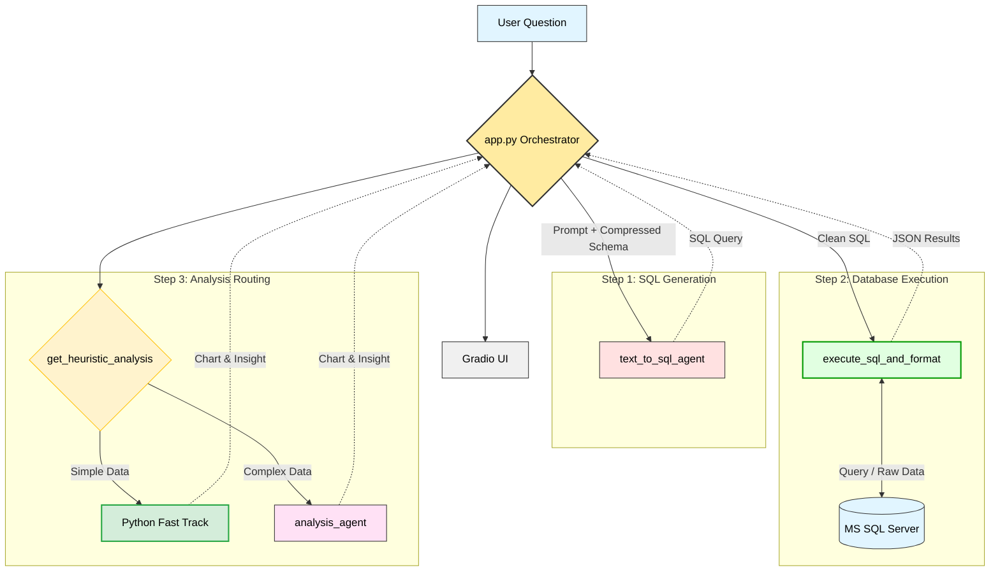

# Agentic-MIS: Optimized BI Agent with Hybrid Architecture


An intelligent, highly optimized Business Intelligence (BI) Assistant that converts natural language into SQL, executes queries against an MS SQL Server, and automatically generates visualizations and business insights. 

By transitioning from a standard Linear Agentic Workflow to a Hybrid Orchestration Architecture, this project successfully **reduced response latency by ~70% and API cost by >50%**.

### Key Engineering Implementations:
1. **Schema Diet & Injection:** Reduced token bloat by filtering out noise (logs, system tables) and injecting only core `Dim_` and `Facts_` tables directly into the prompt.
2. **Heuristic Fast Track:** Implemented rule-based Python logic to intercept simple queries and generate charts instantly (0s latency), bypassing the LLM analysis entirely.
3. **Hybrid Execution:** Replaced the unreliable "SQL Executor Agent" with direct Python execution, saving 1 full API call and eliminating execution hallucinations.
4. **Unified Analyst Agent:** Merged the Visualization and Explanation agents into a single powerful 2-in-1 prompt.


```mermaid
flowchart TD
    User[User Question] --> App{app.py Orchestrator}
    
    subgraph Step 1: SQL Generation
        SQLAgent[text_to_sql_agent]
    end
    
    subgraph Step 2: Database Execution
        DBTool[execute_sql_and_format]
        DB[(MS SQL Server)]
        DBTool <-->|Query / Raw Data| DB
    end
    
    subgraph Step 3: Analysis Routing
        Check{get_heuristic_analysis}
        Fast[Python Fast Track]
        AI[analysis_agent]
        Check -->|Simple Data| Fast
        Check -->|Complex Data| AI
    end

    %% เส้นทางส่งคำสั่งจาก Orchestrator (เส้นทึบ)
    App -->|Prompt + Compressed Schema| SQLAgent
    App -->|Clean SQL| DBTool
    App --> Check
    
    %% เส้นทางส่งข้อมูลกลับมาที่ Orchestrator (เส้นประ ช่วยลดความสับสน)
    SQLAgent -.->|SQL Query| App
    DBTool -.->|JSON Results| App
    Fast -.->|Chart & Insight| App
    AI -.->|Chart & Insight| App
    
    App --> UI[Gradio UI]
    
    %% Styles
    style User fill:#e1f5ff,stroke:#333,color: #000000
    style App fill:#ffeba1,stroke:#333,stroke-width:2px,color: #000000
    style SQLAgent fill:#ffe1e1,stroke:#333,color: #000000
    style DBTool fill:#e1ffe1,stroke:#090,stroke-width:2px,color: #000000
    style DB fill:#e1f5ff,stroke:#333,color: #000000
    style Check fill:#fff3cd,stroke:#ffc107,color: #000000
    style Fast fill:#d4edda,stroke:#28a745,stroke-width:2px,color: #000000
    style AI fill:#ffe1f5,stroke:#333,color: #000000
    style UI fill:#f0f0f0,stroke:#333,color: #000000
```

---

## 📖 System Overview (Architecture, Prompts, Safety, & Evaluation)

### 1. Hybrid Architecture (AI + Python Orchestration)
The system transitioned from a traditional sequential agent chain (Waterfall model) to a **Hybrid Orchestration Architecture**, reducing API calls by over 50% and improving response time from 32.4 seconds to approximately 10 seconds.
* **Step 1: SQL Generation (AI):** The `text_to_sql_agent` receives the user question and an injected, compressed database schema to generate a precise MS SQL query.
* **Step 2: Execution (Python):** Instead of using an LLM to execute queries, a Python function (`execute_sql_and_format`) directly queries the database, eliminating unnecessary AI latency.
* **Step 2.5: Heuristic Fast Track (Python):** A rule-based Python function intercepts simple query results (e.g., 2 columns, <20 rows). It instantly generates Altair chart specifications and text summaries, bypassing further AI processing entirely.
* **Step 3: Unified Analysis (AI):** For complex data that fails the Fast Track, a unified `analysis_agent` handles both visualization (chart code) and insight generation in a single API call.

### 2. Prompt Engineering Strategy
The LLM's performance is driven by highly structured system prompts designed for accuracy and token efficiency:
* **Prompt Diet (Schema Injection & Compression):** Instead of tool-calling, the schema is filtered to include only core reporting tables (`Dim_` and `Facts_`) and compressed into a dense format (e.g., `TableName(Col1(type))`). This reduces context bloat and speeds up "Time-to-First-Token".
* **Hard Constraints:** Strictly enforces the T-SQL dialect (e.g., using `TOP` instead of `LIMIT`) and mandates exact column name matching to prevent hallucinations.
* **Few-Shot Learning:** Includes curated, high-complexity examples (e.g., table JOINs and Date processing) to guide the model's reasoning.
* **Deterministic Visualization Rules:** The `analysis_agent` prompt contains strict rules (e.g., "Always use Horizontal Bar Charts for text categories") to guarantee readable charts.

### 3. Safety and Robustness Measures
* **Query Execution Restrictions:** The system prompt explicitly forbids DML operations (`INSERT`, `UPDATE`, `DELETE`, `DROP`). The database execution tool safely handles read-only (`SELECT`) queries.
* **Data Masking via Schema Filtering:** System tables, logs, and sensitive user tables are programmatically excluded during schema retrieval (`TABLE_NAME LIKE 'Dim_%' OR TABLE_NAME LIKE 'Facts_%'`), ensuring the AI has no access to non-analytical data.
* **Robust JSON Parsing:** Uses regex/indexing (`clean_output.find('{')`) to extract and parse JSON payloads safely, preventing crashes from LLM formatting inconsistencies (like appended Markdown blocks).

### 4. Evaluation Procedure
The pipeline was iteratively tested and measured against a baseline using three core metrics:
* **SQL Accuracy:** Syntactical correctness and logical accuracy of generated SQL against the schema. *(Improved from 2/10 to 10/10)*.
* **Latency:** Measured via Python's `time.time()` at each pipeline stage. Bottleneck analysis directly led to the "Prompt Diet" and "Fast Track" features. *(Reduced from 32.4s to ~10.0s)*.
* **Visualization Quality:** Qualitative assessment ensuring chart types matched data distributions (e.g., avoiding vertical bar charts for long categorical names).

---

## 📈 Architecture Evolution: The Optimization Journey

### V1: The Baseline (Full Sequential Agent)
* **Flow:** `Text-to-SQL -> SQL Executor (AI) -> Data Formatter (AI) -> Visualization (AI) -> Explanation (AI)`
* **Issues:** High latency, frequent API quota limits (4-5 calls/query), and inconsistent visualization choices.

### V2: The Final Hybrid Architecture
Redesigned the system to use **Manual Orchestration (`app.py`)**:
1. **AI Generation:** LLM generates SQL based on a filtered, compressed database schema.
2. **Python Execution:** Python directly executes the SQL (Zero API calls, < 3 seconds).
3. **Smart Routing:** * *Fast Track:* Simple data is visualized instantly via Python rules.
    * *Deep Analysis:* Complex data is sent to a single, unified 2-in-1 AI Agent.

## 📊 Performance Metrics

| Architecture Phase | Accuracy | Latency | API Calls/Query | Visualization Quality |
| :--- | :---: | :---: | :---: | :--- |
| **1. Original Baseline** | 2/10 | 32.4s | 4 - 5 | Poor (Wrong chart types) |
| **2. Cut Middleman** | 7/10 | ~28.0s | 3 - 4 | Poor |
| **3. Prompt Engineering** | 10/10 | ~27.8s | 3 - 4 | Average (Fixed SQL, bad charts) |
| **4. Final Hybrid (Fast Track)**| **10/10** | **~12.0s** | **1 - 2** | **Excellent (Context-aware)** |

---

## 🛠 Tech Stack

* **Core Logic:** Python, Pandas
* **LLM & Framework:** Google Gemini 2.5 Flash, Google ADK (Agent Development Kit)
* **Database:** Microsoft SQL Server
* **Visualization:** Altair
* **Frontend:** Gradio

---

## 🚀 Installation & Setup (Reproducible Environment)

We use `uv` as our highly optimized Python package manager to ensure reproducible builds.

### 1. Install `uv`
```bash
# macOS/Linux
curl -LsSf [https://astral.sh/uv/install.sh](https://astral.sh/uv/install.sh) | sh

# Windows
powershell -c "irm [https://astral.sh/uv/install.ps1](https://astral.sh/uv/install.ps1) | iex"
```

### 2. Clone the Repository
```bash
git clone [https://github.com/paldee/Agentic-MIS.git](https://github.com/paldee/Agentic-MIS.git)
cd Agentic-MIS
```

### 3. Sync Environment & Install Dependencies
```bash
uv sync
```

### 4. Configuration
Create a `.env` file in the root directory and configure your database and API credentials:
```env
# Google Gemini API
GEMINI_API_KEY="your_google_gemini_api_key_here"

# Microsoft SQL Server Database
MSSQL_SERVER="your_server_name_or_ip"
MSSQL_DATABASE="your_database_name"
MSSQL_USERNAME="your_username"
MSSQL_PASSWORD="your_password"
MSSQL_DRIVER="ODBC Driver 18 for SQL Server"
TRUST_SERVER_CERTIFICATE="true"
```

### 5. Run the Application
```bash
uv run app.py
```
Access at: http://127.0.0.1:7860

