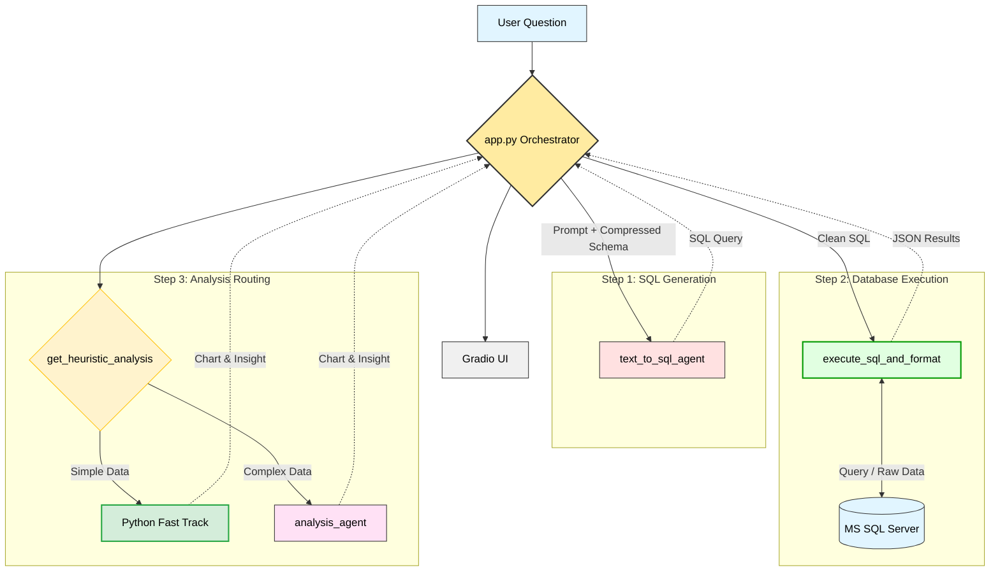

# Agentic-MIS: Optimized BI Agent with Hybrid Architecture


An intelligent, highly optimized Business Intelligence (BI) Assistant that converts natural language into SQL, executes queries against an MS SQL Server, and automatically generates visualizations and business insights. 

This project evolved from a standard Linear Agentic Workflow into a **Hybrid Orchestration Architecture**, reducing response latency by **~70%** and API cost by **>50%**.

**Key Engineering Implementations:**
1. **Schema Diet & Injection:** Reduced token bloat by filtering out noise (logs, system tables) and injecting only core `Dim_` and `Facts_` tables directly into the prompt.
2. **Heuristic Fast Track:** Implemented rule-based Python logic to intercept simple queries and generate charts instantly (0s latency), bypassing the LLM analysis entirely.
3. **Hybrid Execution:** Replaced the unreliable "SQL Executor Agent" with direct Python execution, saving 1 full API call and eliminating execution hallucinations.
4. **Unified Analyst Agent:** Merged the Visualization and Explanation agents into a single powerful 2-in-1 prompt.

```mermaid
flowchart TD
    User[User Question] --> App{app.py Orchestrator}
    
    subgraph Step 1: SQL Generation
        SQLAgent[text_to_sql_agent]
    end
    
    subgraph Step 2: Database Execution
        DBTool[execute_sql_and_format]
        DB[(MS SQL Server)]
        DBTool <-->|Query / Raw Data| DB
    end
    
    subgraph Step 3: Analysis Routing
        Check{get_heuristic_analysis}
        Fast[Python Fast Track]
        AI[analysis_agent]
        Check -->|Simple Data| Fast
        Check -->|Complex Data| AI
    end

    %% เส้นทางส่งคำสั่งจาก Orchestrator (เส้นทึบ)
    App -->|Prompt + Compressed Schema| SQLAgent
    App -->|Clean SQL| DBTool
    App --> Check
    
    %% เส้นทางส่งข้อมูลกลับมาที่ Orchestrator (เส้นประ ช่วยลดความสับสน)
    SQLAgent -.->|SQL Query| App
    DBTool -.->|JSON Results| App
    Fast -.->|Chart & Insight| App
    AI -.->|Chart & Insight| App
    
    App --> UI[Gradio UI]
    
    %% Styles
    style User fill:#e1f5ff,stroke:#333,color: #000000
    style App fill:#ffeba1,stroke:#333,stroke-width:2px,color: #000000
    style SQLAgent fill:#ffe1e1,stroke:#333,color: #000000
    style DBTool fill:#e1ffe1,stroke:#090,stroke-width:2px,color: #000000
    style DB fill:#e1f5ff,stroke:#333,color: #000000
    style Check fill:#fff3cd,stroke:#ffc107,color: #000000
    style Fast fill:#d4edda,stroke:#28a745,stroke-width:2px,color: #000000
    style AI fill:#ffe1f5,stroke:#333,color: #000000
    style UI fill:#f0f0f0,stroke:#333,color: #000000
```

## Architecture Evolution: The Optimization Journey

### V1: The Baseline (Full Sequential Agent)
Initially built using a strict Sequential Agent chain: 
`Text-to-SQL -> SQL Executor (AI) -> Data Formatter (AI) -> Visualization (AI) -> Explanation (AI)`
- **Issues:** High latency, frequent API quota limits (4-5 calls/query), and inconsistent visualization choices.

### V2: The Final Hybrid Architecture
Redesigned the system to use **Manual Orchestration (`app.py`)**:
1. **AI Generation:** LLM generates SQL based on a filtered, compressed database schema.
2. **Python Execution:** Python directly executes the SQL (Zero API calls, < 3 seconds).
3. **Smart Routing:** - *Fast Track:* Simple data is visualized instantly via Python rules.
   - *Deep Analysis:* Complex data is sent to a single, unified 2-in-1 AI Agent.

## Performance Metrics

| Architecture Phase | Accuracy | Latency | API Calls/Query | Visualization Quality |
| :--- | :---: | :---: | :---: | :--- |
| **1. Original Baseline** | 2/10 | 32.4s | 4 - 5 | Poor (Wrong chart types) |
| **2. Cut Middleman** | 7/10 | ~28.0s | 3 - 4 | Poor |
| **3. Prompt Engineering** | 10/10 | ~27.8s | 3 - 4 | Average (Fixed SQL, bad charts) |
| **4. Final Hybrid (Fast Track)**| **10/10** | **~12.0s** | **1 - 2** | **Excellent (Context-aware)** |

## Tech Stack

- **Core Logic:** Python, Pandas
- **LLM & Framework:** Google Gemini 2.5 Flash, Google ADK (Agent Development Kit)
- **Database:** Microsoft SQL Server
- **Visualization:** Altair
- **Frontend:** Gradio

## Installation & Setup
1. Install uv
```bash
# macOS/Linux
curl -LsSf [https://astral.sh/uv/install.sh](https://astral.sh/uv/install.sh) | sh

# Windows
powershell -c "irm [https://astral.sh/uv/install.ps1](https://astral.sh/uv/install.ps1) | iex"
```
2. Clone the Repository
```bash
git clone https://github.com/paldee/Agentic-MIS.git
cd Agentic-MIS
```
3. Create Virtual Environment & Install Dependencies
```bash
uv venv
# On macOS/Linux:
source .venv/bin/activate
# On Windows:
.venv\Scripts\activate
uv pip install -r requirements.txt
```
4. Configuration
   Create a .env file in the bi_agent/ directory and configure your database and API credentials:
```bash 
# Google Gemini API
GEMINI_API_KEY="your_google_gemini_api_key_here"

# Microsoft SQL Server Database
MSSQL_SERVER="your_server_name_or_ip"
MSSQL_DATABASE="your_database_name"
MSSQL_USERNAME="your_username"
MSSQL_PASSWORD="your_password"
MSSQL_DRIVER="ODBC Driver 18 for SQL Server"
TRUST_SERVER_CERTIFICATE="true"
```
5. Run the Application
```bash
uv run app.py
